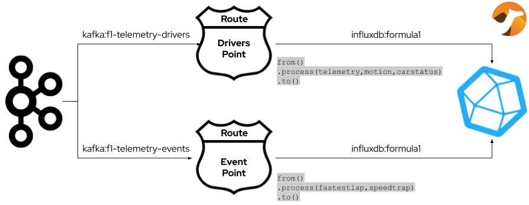

# Formula 1 - Telemetry with Apache Kafka and Apache Camel

## Overview

### F1 2020 Xbox UDP to Kafka

### Kafka to InfluxDB

## Components

Contains different components for ingesting and handling Formula 1 2020 game (by CodeMasters) telemetry data through Apache Kafka.

* **f1-telemetry-udp-kafka**: Apache Camel application bridging the telemetry packets got on UDP from the Formula 1 2020 game to Apache Kafka to different topics:
    * _f1-telemetry-packets_ contains the raw `Packet`(s);
    * _f1-telemetry-events_ contains only the raw `Packet`(s) of `EVENT` type;
    * _f1-telemetry-drivers_ contains the `Driver` messages as result of aggregating `Packet`(s) in the same frame with telemetry data for all drivers;
* **f1-telemetry-consumer**: Apache Kafka client application consuming `Driver` messages from Apache Kafka;
* **f1-telemetry-streams**: Apache Kafka Streams API based application getting raw `Packet`(s) and processing in real time;
* **f1-telemetry-common**: common library providing model classes and related Apache Kafka serializer/deserializer;
* **f1-telemetry-kafka-influxdb**: Apache Camel application writing driver/car's telemetry data  to InfluxDB as time series; 
* **f1-telemetry-webui**: A sample Web application showing the race ranking in real time getting `Driver`(s) from Apache Kafka;
* **dashboard**: folder containing Grafana dashboard showing driver/car's telemetry data;
* **deployment**: folder containing Kubernetes deployments for all the provided applications;

The Formula 1 2020 game UDP packets specification is [here](https://forums.codemasters.com/topic/50942-f1-2020-udp-specification/).
The library used for decoding the packets is [here](https://github.com/ppatierno/formula1-telemetry).

## Dashboards

